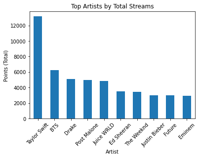
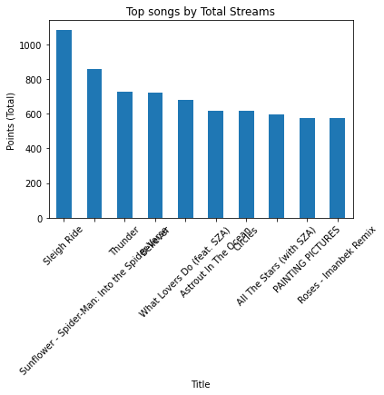
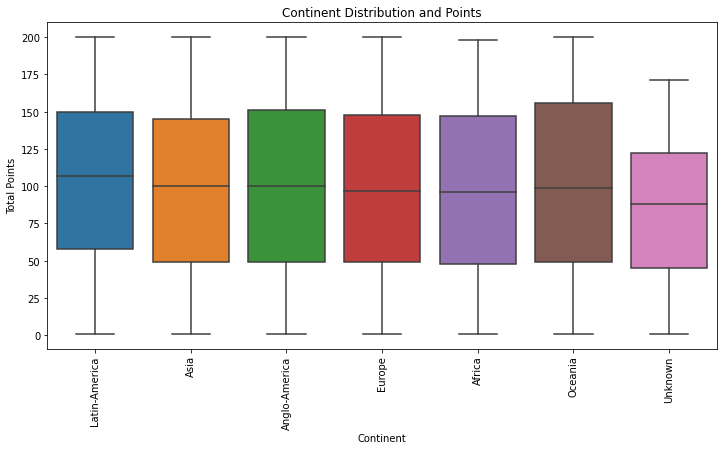
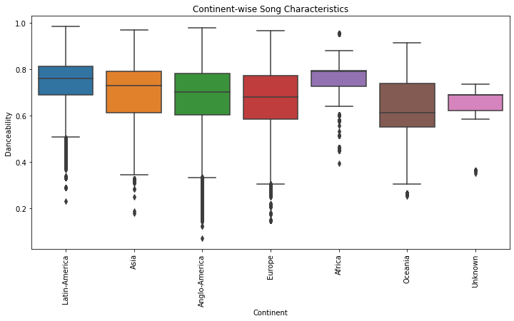

```python
#Importing librairies 
```


```python
import pandas as pd
import numpy as np
import matplotlib.pyplot as plt
import seaborn as sns
```


```python
#load the dataset 
```


```python
dir = 'C:/Users/thoma/Downloads/Spotify'
```


```python
songs = pd.read_csv(dir+ '/Spotify_Dataset_V3.csv', sep=';', encoding='utf-8')
```


```python
#data exploration
```


```python
columns_to_drop = [ 'Song URL']
songs.drop(columns_to_drop, axis=1, inplace=True)
```


```python
songs.head()
```


<div>
<style scoped>
    .dataframe tbody tr th:only-of-type {
        vertical-align: middle;
    }

    .dataframe tbody tr th {
        vertical-align: top;
    }

    .dataframe thead th {
        text-align: right;
    }
</style>
<table border="1" class="dataframe">
  <thead>
    <tr style="text-align: right;">
      <th></th>
      <th>Rank</th>
      <th>Title</th>
      <th>Artists</th>
      <th>Date</th>
      <th>Danceability</th>
      <th>Energy</th>
      <th>Loudness</th>
      <th>Speechiness</th>
      <th>Acousticness</th>
      <th>Instrumentalness</th>
      <th>Valence</th>
      <th># of Artist</th>
      <th>Artist (Ind.)</th>
      <th># of Nationality</th>
      <th>Nationality</th>
      <th>Continent</th>
      <th>Points (Total)</th>
      <th>Points (Ind for each Artist/Nat)</th>
      <th>id</th>
    </tr>
  </thead>
  <tbody>
    <tr>
      <th>0</th>
      <td>1</td>
      <td>Ella Baila Sola</td>
      <td>Eslabon Armado, Peso Pluma</td>
      <td>29/05/2023</td>
      <td>0.668</td>
      <td>0.758</td>
      <td>-5176.0</td>
      <td>0.033</td>
      <td>0.483</td>
      <td>0.000</td>
      <td>0.834</td>
      <td>Artist 1</td>
      <td>Eslabon Armado</td>
      <td>Nationality 1</td>
      <td>Mexico</td>
      <td>Latin-America</td>
      <td>200</td>
      <td>100.0</td>
      <td>3qQbCzHBycnDpGskqOWY0E</td>
    </tr>
    <tr>
      <th>1</th>
      <td>1</td>
      <td>Ella Baila Sola</td>
      <td>Eslabon Armado, Peso Pluma</td>
      <td>29/05/2023</td>
      <td>0.668</td>
      <td>0.758</td>
      <td>-5176.0</td>
      <td>0.033</td>
      <td>0.483</td>
      <td>0.000</td>
      <td>0.834</td>
      <td>Artist 2</td>
      <td>Peso Pluma</td>
      <td>Nationality 2</td>
      <td>Mexico</td>
      <td>Latin-America</td>
      <td>200</td>
      <td>100.0</td>
      <td>3qQbCzHBycnDpGskqOWY0E</td>
    </tr>
    <tr>
      <th>2</th>
      <td>2</td>
      <td>WHERE SHE GOES</td>
      <td>Bad Bunny</td>
      <td>29/05/2023</td>
      <td>0.652</td>
      <td>0.800</td>
      <td>-4019.0</td>
      <td>0.061</td>
      <td>0.143</td>
      <td>0.629</td>
      <td>0.234</td>
      <td>Artist 1</td>
      <td>Bad Bunny</td>
      <td>Nationality 1</td>
      <td>Puerto Rico</td>
      <td>Latin-America</td>
      <td>199</td>
      <td>199.0</td>
      <td>7ro0hRteUMfnOioTFI5TG1</td>
    </tr>
    <tr>
      <th>3</th>
      <td>3</td>
      <td>La Bebe - Remix</td>
      <td>Yng Lvcas, Peso Pluma</td>
      <td>29/05/2023</td>
      <td>0.812</td>
      <td>0.479</td>
      <td>-5678.0</td>
      <td>0.333</td>
      <td>0.213</td>
      <td>0.000</td>
      <td>0.559</td>
      <td>Artist 1</td>
      <td>Yng Lvcas</td>
      <td>Nationality 1</td>
      <td>Mexico</td>
      <td>Latin-America</td>
      <td>198</td>
      <td>99.0</td>
      <td>2UW7JaomAMuX9pZrjVpHAU</td>
    </tr>
    <tr>
      <th>4</th>
      <td>3</td>
      <td>La Bebe - Remix</td>
      <td>Yng Lvcas, Peso Pluma</td>
      <td>29/05/2023</td>
      <td>0.812</td>
      <td>0.479</td>
      <td>-5678.0</td>
      <td>0.333</td>
      <td>0.213</td>
      <td>0.000</td>
      <td>0.559</td>
      <td>Artist 2</td>
      <td>Peso Pluma</td>
      <td>Nationality 2</td>
      <td>Mexico</td>
      <td>Latin-America</td>
      <td>198</td>
      <td>99.0</td>
      <td>2UW7JaomAMuX9pZrjVpHAU</td>
    </tr>
  </tbody>
</table>
</div>


```python
songs.describe()
```


<div>
<style scoped>
    .dataframe tbody tr th:only-of-type {
        vertical-align: middle;
    }

    .dataframe tbody tr th {
        vertical-align: top;
    }

    .dataframe thead th {
        text-align: right;
    }
</style>
<table border="1" class="dataframe">
  <thead>
    <tr style="text-align: right;">
      <th></th>
      <th>Rank</th>
      <th>Danceability</th>
      <th>Energy</th>
      <th>Loudness</th>
      <th>Speechiness</th>
      <th>Acousticness</th>
      <th>Instrumentalness</th>
      <th>Valence</th>
      <th>Points (Total)</th>
      <th>Points (Ind for each Artist/Nat)</th>
    </tr>
  </thead>
  <tbody>
    <tr>
      <th>count</th>
      <td>651936.000000</td>
      <td>651936.000000</td>
      <td>651936.000000</td>
      <td>651936.000000</td>
      <td>651936.000000</td>
      <td>651936.000000</td>
      <td>651936.000000</td>
      <td>651936.000000</td>
      <td>651936.000000</td>
      <td>651936.000000</td>
    </tr>
    <tr>
      <th>mean</th>
      <td>100.407782</td>
      <td>0.697730</td>
      <td>0.652049</td>
      <td>-5295.645217</td>
      <td>0.109946</td>
      <td>0.230694</td>
      <td>0.007647</td>
      <td>0.523134</td>
      <td>100.592218</td>
      <td>72.391141</td>
    </tr>
    <tr>
      <th>std</th>
      <td>57.406664</td>
      <td>0.133186</td>
      <td>0.155684</td>
      <td>2785.261321</td>
      <td>0.096841</td>
      <td>0.230710</td>
      <td>0.054724</td>
      <td>0.223926</td>
      <td>57.406664</td>
      <td>54.227892</td>
    </tr>
    <tr>
      <th>min</th>
      <td>1.000000</td>
      <td>0.073000</td>
      <td>0.005000</td>
      <td>-34475.000000</td>
      <td>0.022000</td>
      <td>0.000000</td>
      <td>0.000000</td>
      <td>0.026000</td>
      <td>1.000000</td>
      <td>0.200000</td>
    </tr>
    <tr>
      <th>25%</th>
      <td>51.000000</td>
      <td>0.617000</td>
      <td>0.549000</td>
      <td>-6825.000000</td>
      <td>0.045000</td>
      <td>0.048000</td>
      <td>0.000000</td>
      <td>0.356000</td>
      <td>51.000000</td>
      <td>28.000000</td>
    </tr>
    <tr>
      <th>50%</th>
      <td>100.000000</td>
      <td>0.719000</td>
      <td>0.671000</td>
      <td>-5206.000000</td>
      <td>0.068000</td>
      <td>0.152000</td>
      <td>0.000000</td>
      <td>0.521000</td>
      <td>101.000000</td>
      <td>60.000000</td>
    </tr>
    <tr>
      <th>75%</th>
      <td>150.000000</td>
      <td>0.793000</td>
      <td>0.771000</td>
      <td>-3885.000000</td>
      <td>0.136000</td>
      <td>0.349000</td>
      <td>0.000000</td>
      <td>0.696000</td>
      <td>150.000000</td>
      <td>104.000000</td>
    </tr>
    <tr>
      <th>max</th>
      <td>200.000000</td>
      <td>0.985000</td>
      <td>0.996000</td>
      <td>1509.000000</td>
      <td>0.966000</td>
      <td>0.994000</td>
      <td>0.956000</td>
      <td>0.982000</td>
      <td>200.000000</td>
      <td>200.000000</td>
    </tr>
  </tbody>
</table>
</div>


```python
songs.info()
```

    <class 'pandas.core.frame.DataFrame'>
    RangeIndex: 651936 entries, 0 to 651935
    Data columns (total 19 columns):
     #   Column                            Non-Null Count   Dtype  
    ---  ------                            --------------   -----  
     0   Rank                              651936 non-null  int64  
     1   Title                             651936 non-null  object 
     2   Artists                           651936 non-null  object 
     3   Date                              651936 non-null  object 
     4   Danceability                      651936 non-null  float64
     5   Energy                            651936 non-null  float64
     6   Loudness                          651936 non-null  float64
     7   Speechiness                       651936 non-null  float64
     8   Acousticness                      651936 non-null  float64
     9   Instrumentalness                  651936 non-null  float64
     10  Valence                           651936 non-null  float64
     11  # of Artist                       651936 non-null  object 
     12  Artist (Ind.)                     651936 non-null  object 
     13  # of Nationality                  651936 non-null  object 
     14  Nationality                       651936 non-null  object 
     15  Continent                         651936 non-null  object 
     16  Points (Total)                    651936 non-null  int64  
     17  Points (Ind for each Artist/Nat)  651936 non-null  float64
     18  id                                651936 non-null  object 
    dtypes: float64(8), int64(2), object(9)
    memory usage: 94.5+ MB
    


```python
songs.dtypes
```


    Rank                                  int64
    Title                                object
    Artists                              object
    Date                                 object
    Danceability                        float64
    Energy                              float64
    Loudness                            float64
    Speechiness                         float64
    Acousticness                        float64
    Instrumentalness                    float64
    Valence                             float64
    # of Artist                          object
    Artist (Ind.)                        object
    # of Nationality                     object
    Nationality                          object
    Continent                            object
    Points (Total)                        int64
    Points (Ind for each Artist/Nat)    float64
    id                                   object
    dtype: object


```python
# DATA Cleaning and preparing
```


```python
#verifying Data if there is a missing values
```


```python
songs.isnull()
```


<div>
<style scoped>
    .dataframe tbody tr th:only-of-type {
        vertical-align: middle;
    }

    .dataframe tbody tr th {
        vertical-align: top;
    }

    .dataframe thead th {
        text-align: right;
    }
</style>
<table border="1" class="dataframe">
  <thead>
    <tr style="text-align: right;">
      <th></th>
      <th>Rank</th>
      <th>Title</th>
      <th>Artists</th>
      <th>Date</th>
      <th>Danceability</th>
      <th>Energy</th>
      <th>Loudness</th>
      <th>Speechiness</th>
      <th>Acousticness</th>
      <th>Instrumentalness</th>
      <th>Valence</th>
      <th># of Artist</th>
      <th>Artist (Ind.)</th>
      <th># of Nationality</th>
      <th>Nationality</th>
      <th>Continent</th>
      <th>Points (Total)</th>
      <th>Points (Ind for each Artist/Nat)</th>
      <th>id</th>
    </tr>
  </thead>
  <tbody>
    <tr>
      <th>0</th>
      <td>False</td>
      <td>False</td>
      <td>False</td>
      <td>False</td>
      <td>False</td>
      <td>False</td>
      <td>False</td>
      <td>False</td>
      <td>False</td>
      <td>False</td>
      <td>False</td>
      <td>False</td>
      <td>False</td>
      <td>False</td>
      <td>False</td>
      <td>False</td>
      <td>False</td>
      <td>False</td>
      <td>False</td>
    </tr>
    <tr>
      <th>1</th>
      <td>False</td>
      <td>False</td>
      <td>False</td>
      <td>False</td>
      <td>False</td>
      <td>False</td>
      <td>False</td>
      <td>False</td>
      <td>False</td>
      <td>False</td>
      <td>False</td>
      <td>False</td>
      <td>False</td>
      <td>False</td>
      <td>False</td>
      <td>False</td>
      <td>False</td>
      <td>False</td>
      <td>False</td>
    </tr>
    <tr>
      <th>2</th>
      <td>False</td>
      <td>False</td>
      <td>False</td>
      <td>False</td>
      <td>False</td>
      <td>False</td>
      <td>False</td>
      <td>False</td>
      <td>False</td>
      <td>False</td>
      <td>False</td>
      <td>False</td>
      <td>False</td>
      <td>False</td>
      <td>False</td>
      <td>False</td>
      <td>False</td>
      <td>False</td>
      <td>False</td>
    </tr>
    <tr>
      <th>3</th>
      <td>False</td>
      <td>False</td>
      <td>False</td>
      <td>False</td>
      <td>False</td>
      <td>False</td>
      <td>False</td>
      <td>False</td>
      <td>False</td>
      <td>False</td>
      <td>False</td>
      <td>False</td>
      <td>False</td>
      <td>False</td>
      <td>False</td>
      <td>False</td>
      <td>False</td>
      <td>False</td>
      <td>False</td>
    </tr>
    <tr>
      <th>4</th>
      <td>False</td>
      <td>False</td>
      <td>False</td>
      <td>False</td>
      <td>False</td>
      <td>False</td>
      <td>False</td>
      <td>False</td>
      <td>False</td>
      <td>False</td>
      <td>False</td>
      <td>False</td>
      <td>False</td>
      <td>False</td>
      <td>False</td>
      <td>False</td>
      <td>False</td>
      <td>False</td>
      <td>False</td>
    </tr>
    <tr>
      <th>...</th>
      <td>...</td>
      <td>...</td>
      <td>...</td>
      <td>...</td>
      <td>...</td>
      <td>...</td>
      <td>...</td>
      <td>...</td>
      <td>...</td>
      <td>...</td>
      <td>...</td>
      <td>...</td>
      <td>...</td>
      <td>...</td>
      <td>...</td>
      <td>...</td>
      <td>...</td>
      <td>...</td>
      <td>...</td>
    </tr>
    <tr>
      <th>651931</th>
      <td>False</td>
      <td>False</td>
      <td>False</td>
      <td>False</td>
      <td>False</td>
      <td>False</td>
      <td>False</td>
      <td>False</td>
      <td>False</td>
      <td>False</td>
      <td>False</td>
      <td>False</td>
      <td>False</td>
      <td>False</td>
      <td>False</td>
      <td>False</td>
      <td>False</td>
      <td>False</td>
      <td>False</td>
    </tr>
    <tr>
      <th>651932</th>
      <td>False</td>
      <td>False</td>
      <td>False</td>
      <td>False</td>
      <td>False</td>
      <td>False</td>
      <td>False</td>
      <td>False</td>
      <td>False</td>
      <td>False</td>
      <td>False</td>
      <td>False</td>
      <td>False</td>
      <td>False</td>
      <td>False</td>
      <td>False</td>
      <td>False</td>
      <td>False</td>
      <td>False</td>
    </tr>
    <tr>
      <th>651933</th>
      <td>False</td>
      <td>False</td>
      <td>False</td>
      <td>False</td>
      <td>False</td>
      <td>False</td>
      <td>False</td>
      <td>False</td>
      <td>False</td>
      <td>False</td>
      <td>False</td>
      <td>False</td>
      <td>False</td>
      <td>False</td>
      <td>False</td>
      <td>False</td>
      <td>False</td>
      <td>False</td>
      <td>False</td>
    </tr>
    <tr>
      <th>651934</th>
      <td>False</td>
      <td>False</td>
      <td>False</td>
      <td>False</td>
      <td>False</td>
      <td>False</td>
      <td>False</td>
      <td>False</td>
      <td>False</td>
      <td>False</td>
      <td>False</td>
      <td>False</td>
      <td>False</td>
      <td>False</td>
      <td>False</td>
      <td>False</td>
      <td>False</td>
      <td>False</td>
      <td>False</td>
    </tr>
    <tr>
      <th>651935</th>
      <td>False</td>
      <td>False</td>
      <td>False</td>
      <td>False</td>
      <td>False</td>
      <td>False</td>
      <td>False</td>
      <td>False</td>
      <td>False</td>
      <td>False</td>
      <td>False</td>
      <td>False</td>
      <td>False</td>
      <td>False</td>
      <td>False</td>
      <td>False</td>
      <td>False</td>
      <td>False</td>
      <td>False</td>
    </tr>
  </tbody>
</table>
<p>651936 rows × 19 columns</p>
</div>


```python
songs.duplicated()
```


    0         False
    1         False
    2         False
    3         False
    4         False
              ...  
    651931    False
    651932    False
    651933    False
    651934    False
    651935    False
    Length: 651936, dtype: bool


```python
songs.drop_duplicates(subset=['id'])
spotify_songs =songs.drop_duplicates(subset=['id'])
```


```python
#finding top artist list
```


```python
artist_stats = spotify_songs.groupby('Artists')['Points (Total)'].sum()
```


```python
# Sort in descending order and display the top artists
top_artists = artist_stats.sort_values(ascending=False).head(10)
print(top_artists)

```

    Artists
    Taylor Swift     13188
    BTS               6249
    Drake             5105
    Post Malone       4966
    Juice WRLD        4828
    Ed Sheeran        3485
    The Weeknd        3436
    Justin Bieber     3023
    Future            3006
    Eminem            2961
    Name: Points (Total), dtype: int64
    


```python

top_artists.plot(kind='bar')
plt.xlabel('Artist')
plt.ylabel('Points (Total) ')  # Replace with the appropriate label
plt.title('Top Artists by Total Streams')
plt.xticks(rotation=45)  # Rotate x-axis labels for better visibility

plt.show()

```


    

    


```python
#finding most popular song
```


```python
songs_stats = spotify_songs.groupby('Title')['Points (Total)'].sum()
```


```python
# Sort in descending order and display the top artists
top_songs = songs_stats.sort_values(ascending=False).head(10)
print(top_songs)
```

    Title
    Sleigh Ride                                      1085
    Sunflower - Spider-Man: Into the Spider-Verse     859
    Thunder                                           729
    Believer                                          724
    What Lovers Do (feat. SZA)                        681
    Astrout In The Ocean                              618
    Circles                                           617
    All The Stars (with SZA)                          595
    PAINTING PICTURES                                 577
    Roses - Imanbek Remix                             576
    Name: Points (Total), dtype: int64
    


```python
top_songs.plot(kind='bar')
plt.xlabel('Title')
plt.ylabel('Points (Total) ')  
plt.title('Top songs by Total Streams')
plt.xticks(rotation=45)  # Rotate x-axis labels for better visibility

plt.show()
```


    

    


```python
#relation between streams and Continent

plt.figure(figsize=(12, 6))
sns.boxplot(data=songs, x='Continent', y='Points (Total)')
plt.title('Continent Distribution and Points')
plt.xlabel('Continent')
plt.ylabel('Total Points')
plt.xticks(rotation=90)  # Rotate x-axis labels for better readability
plt.show()
```


    

    


```python
# Wise songs per continent
characteristics_cols = ['Danceability', 'Energy', 'Valence']  # Add more if needed

# Create a Box Plot or Heatmap
plt.figure(figsize=(12, 6))
sns.boxplot(data=songs, x='Continent', y=characteristics_cols[0])
plt.title('Continent-wise Song Characteristics')
plt.xlabel('Continent')
plt.ylabel(characteristics_cols[0])
plt.xticks(rotation=90)  # Rotate x-axis labels for better readability
plt.show()
```


    

    


```python

```
